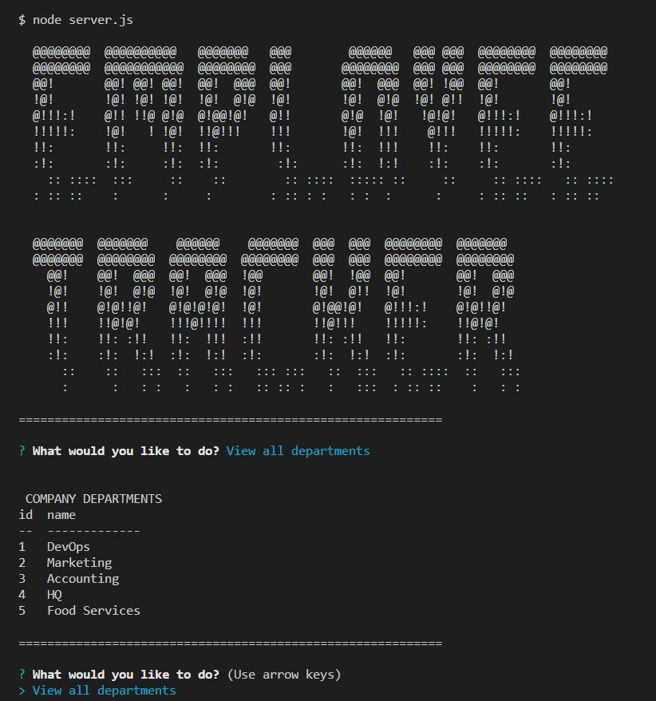

# Employee Tracker

## Description

Use the command line to plan and manage employees of your business.

## Screenshot

## Table of Contents 

* [Installation](#installation)
* [Usage](#usage)
* [Demo](#demo)
* [License](#license)

## Installation

Clone, npm install and populate the database using your own data.

## Usage

Once you've added your own data use the CLI to manage your employees. 

## Demo Video
A demo video of this app can be viewed at https://drive.google.com/file/d/16QxIDn4E7Tu1OIboh63-eziFtJIlJQIl/view

## License

This project uses the MIT License. More info about this license can be found at https://opensource.org/licenses/MIT
    
## Questions

For additional information on this project contact me by email at shawnevans.music@gmail.com or visit my GitHub page at https://github.com/bluesatyr.